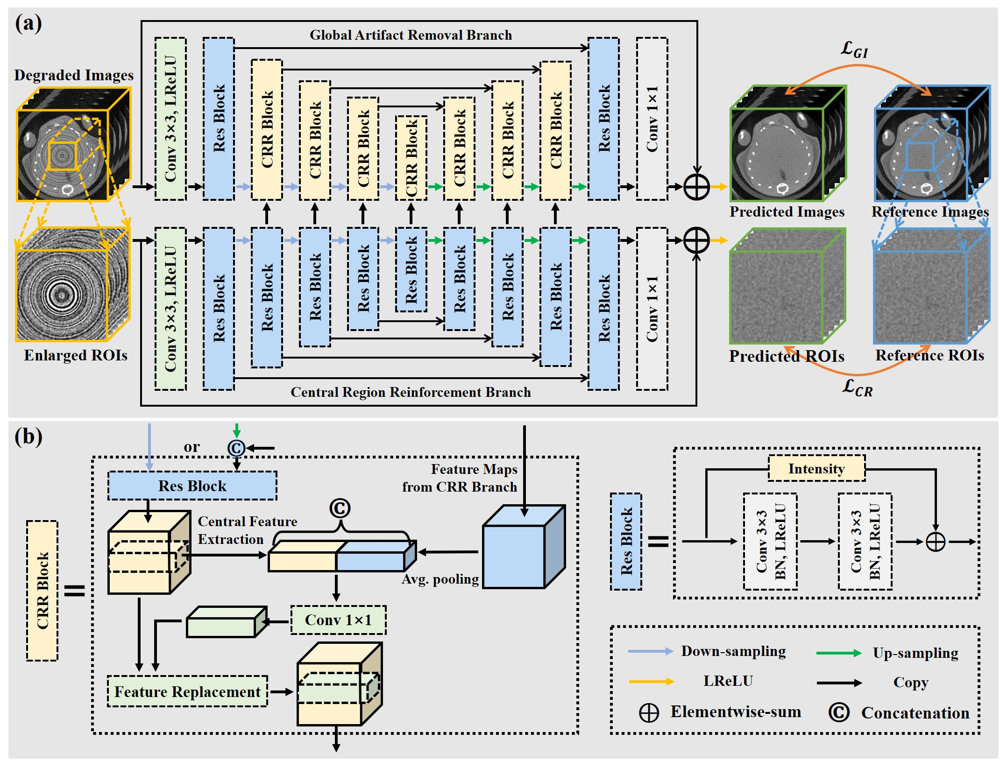
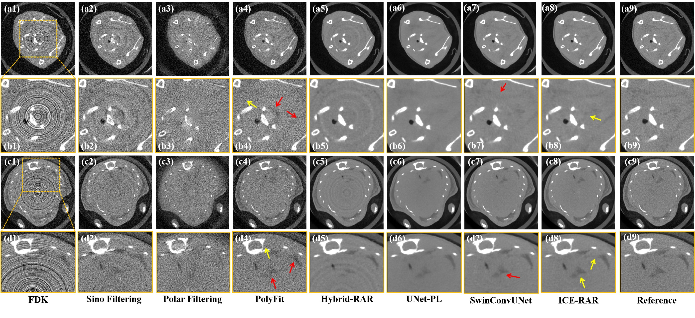
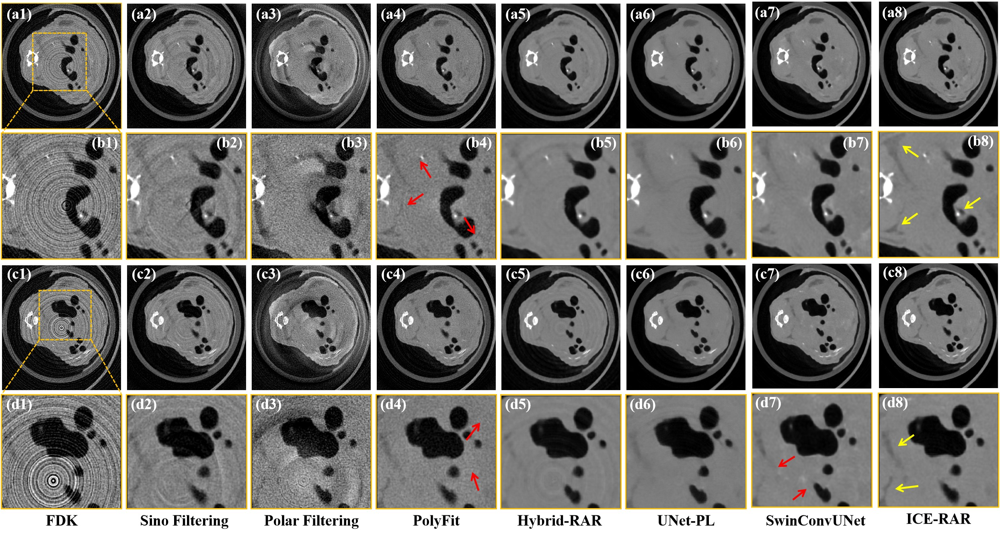
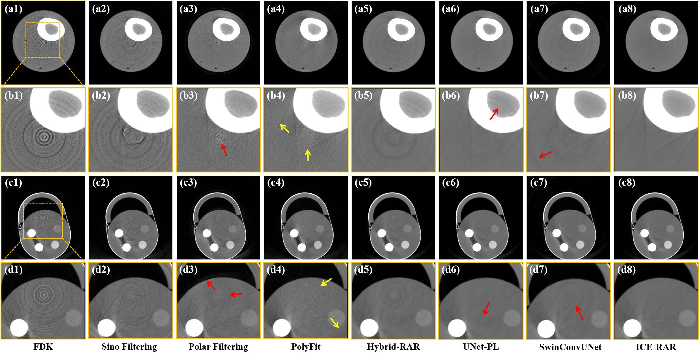

## Inter-slice Complementarity Enhanced Ring Artifact Removal using Central Region Reinforced Neural Network
Yikun Zhang, Guannan Liu, Yang Chen, et al.


## Abstract
> In computed tomography (CT), non-uniform detector responses often lead to ring artifacts in reconstructed images. For conventional energy-integrating detectors (EIDs), such artifacts can be effectively addressed through dead-pixel correction and flat-dark field calibration. However, the response characteristics of photon-counting detectors (PCDs) are more complex, and standard calibration procedures can only partially mitigate ring artifacts. Consequently, developing high-performance ring artifact removal algorithms is essential for PCD-based CT systems. To this end, we propose the Inter-slice Complementarity Enhanced Ring Artifact Removal (ICE-RAR) algorithm. Since artifact removal in the central region is particularly challenging, ICE-RAR utilizes a dual-branch neural network that could simultaneously perform global artifact removal and enhance the central region restoration. Moreover, recognizing that the detector response is also non-uniform in the vertical direction, ICE-RAR suggests extracting and utilizing inter-slice complementarity to enhance its performance in artifact elimination and image restoration. Experiments on simulated data and two real datasets acquired from PCD-based CT systems demonstrate the effectiveness of ICE-RAR in reducing ring artifacts while preserving structural details. More importantly, since the system-specific characteristics are incorporated into the data simulation process, models trained on the simulated data can be directly applied to unseen real data from the target PCD-based CT system, demonstrating ICE-RAR's potential to address the ring artifact removal problem in practical CT systems.

## Architecture Diagram
<p align="center">  </p>

## Visual Comparisons on Simulation Rat Data
<p align="center">  </p>

## Visual Comparisons on Real Rat Data
<p align="center">  </p>

## Visual Comparisons on Real Bone and Phantom Data
<p align="center">  </p>


## Usage
### 1.Environment Setup
```
cd ./
pip install -r requirements.txt
```

### 2. Data preparation
To generate simulated 3D data with ring artifacts and noise:
```
python s1_data_simulation.py
```
To generate p3d data for training and validating:
```
python s2_make_2d_data_pairs.py
```

### 3. Model Training
To begin rat data training:
```
# Update the TXT file path in train.py to match the path of the TXT file generated in Step 2. 
python s3_train.py
```

### 4. Model test

To begin rat data testing:
```
python s4_test.py
```

## Notes
Code and model configurations are tested under Python 3.9+, PyTorch 1.12+. 


## Acknowledgment

This repository is an implementation and extended adaptation of Inter-slice Complementarity Enhanced Ring Artifact Removal using Central Region Reinforced Neural Network in code structure, documentation, and model reproducibility.


